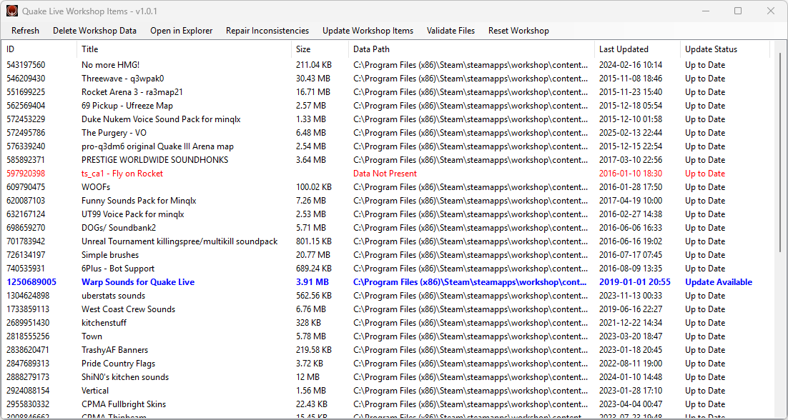

# WorkshopItems

A Windows desktop application for managing Steam Workshop items, detecting inconsistencies, and performing maintenance operations on cached workshop content.


## Overview

WorkshopItems is a graphical tool that provides an interface for managing Steam Workshop content. It helps identify and resolve common workshop issues such as:
- Outdated workshop items (often causing client purity issues due to mismatched `.pk3`s in Quake Live).
- Orphaned workshop entries in Steam's manifest files.
- Missing workshop data files.
- Corrupted workshop content.

Currently configured for [**Quake Live**](https://store.steampowered.com/app/282440/Quake_Live/) (App ID: 282440) but can be easily adapted for other Steam games via simple modification to `GAME_APPID`.

## Program Features

- **Workshop Item Listing**: View all installed workshop items with details including ID, title, size, file path, and update status.
- **Inconsistency Detection**: Automatically detect mismatches between Steam's manifest and actual files on disk.
- **Bulk Operations**: Select multiple items for deletion or updates.
- **Update Management**: Check for and download available workshop updates.
- **File Validation**: Validate game files and workshop content integrity.
- **Workshop Reset**: Completely reset workshop data for a fresh start.
- **Explorer Integration**: Open workshop item folders directly in Windows Explorer.
- **SteamCMD Integration/Management**: Automatically downloads and uses SteamCMD for workshop operations.
- **Multi-Library Support**: Works with games installed across multiple Steam library folders in non-default locations.

## System Requirements

- Windows 10/11.
- [.NET 8.0 Desktop Runtime](https://dotnet.microsoft.com/en-us/download/dotnet/8.0/runtime).
- Steam installed.

## Obtaining WorkshopItems

### Option 1: Download Release
1. Go to the [Releases](../../releases) page.
2. Download the latest `WorkshopItems.zip`.
3. Extract to your preferred location.
4. Run `WorkshopItems.exe`.

### Option 2: Build from Source
See more about this option [below](#building-from-source).

## Screenshot


## Usage Guide - for end-users

### On Launch
1. The application will automatically detect your Steam installation.
2. It will check if the configured game is installed.
3. If Steam or SteamCMD is running, you'll be prompted to close them.

### Main Interface
- **Populate/Refresh**: Load or refresh the workshop items list.
- **Delete Workshop Data**: Remove selected items and update Steam's manifest.
- **Open in Explorer**: Browse to selected item folders.
- **Repair Inconsistencies**: Fix orphaned manifest entries.
- **Update Workshop Items**: Download available updates.
- **Validate Files**: Check game and workshop file integrity.
- **Reset Workshop**: Complete workshop data reset.

### Common Tasks

#### Fixing "Data Not Present" Items
1. Click **Repair Inconsistencies**.
2. Confirm removal of orphaned entries.
3. Refresh the list.

#### Updating Workshop Items
1. Items with updates show in blue with "Update Available".
2. Click **Update Workshop Items** or right-click for selected updates.
3. Monitor progress in the console window.

#### Deleting Workshop Content
1. Select items to delete.
2. Click **Delete Workshop Data**.
3. Confirm the operation.

## Configuration - for developers

### Changing the Target Game
To use with a different Steam game:

1. Find your game's App ID:
   - Visit the game's Steam store page.
   - The ID is in the URL: `store.steampowered.com/app/[APP_ID]`

2. Edit `MainForm.cs`:
   ```csharp
   private const int GAME_APPID = 282440; // Change this to your game's ID
   ```

3. Rebuild the application using the instructions [below](#building-from-source).


## Building from Source

### Prerequisites
- Visual Studio 2022 or later with .NET desktop development workload.
- Or the .NET 8.0 SDK.

### Build Steps
```
# Clone the repository
git clone https://github.com/tjone270/WorkshopItems.git
cd WorkshopItems

# Restore dependencies
dotnet restore

# Build
dotnet build -c Release

# Run
dotnet run --project WorkshopItems
```

## Contributing

Contributions are welcome, feel free to submit a pull request.

### Development Guidelines
- Follow C# default coding conventions.
- Add XML documentation for classes/methods.
- Test with multiple Steam library configurations.
- Ensure backwards compatibility with Windows 10.

## License

This project is licensed under the MIT License - see the [LICENSE](LICENSE) file for details.

## Acknowledgments

- [Gameloop.Vdf](https://github.com/shravan2x/Gameloop.Vdf) for VDF parsing.
- [Valve](https://www.valvesoftware.com/en/) for Steam and SteamCMD.
- [id Software](https://www.idsoftware.com/en) for making Quake Live available via Steam and not just letting it die off.
- The Quake Live community who motivated me to build this tool in the first place.

## Disclaimer

This software is not affiliated with Valve Corporation, id Software or other publishers.

Use at your own risk.